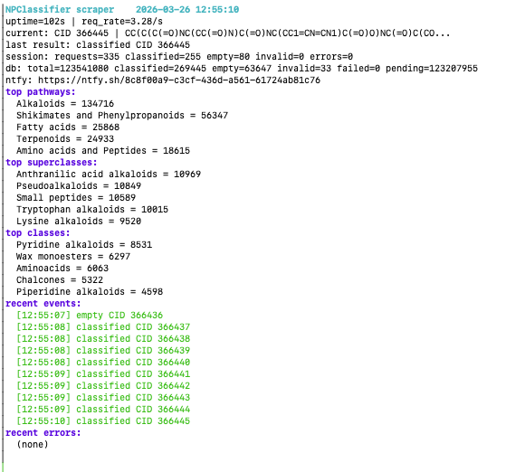

# NPC-Labeler

[](https://doi.org/10.5281/zenodo.14040990)
[](https://github.com/earth-metabolome-initiative/npc-labeler/actions/workflows/ci.yml)

A tool to build an open-source training dataset for natural product classification by scraping the [NPClassifier](https://npclassifier.gnps2.org/) API across all of PubChem.

NPClassifier classifies natural products into pathways, superclasses, and classes. The model is not open source: the authors host it as a web service but do not release the model weights or training data. This project queries the API for all ~123M PubChem SMILES and stores the results in a SQLite database, creating a fully open dataset that can be used to train an open-source replacement.

> [!IMPORTANT]
> *We do not recommend running this tool yourself. We are already running it and publishing updated snapshots of the dataset to [Zenodo](https://doi.org/10.5281/zenodo.14040990) on a weekly cadence. The code is shared for transparency and reproducibility. If you need the classification data, please use the Zenodo dataset rather than placing additional load on the NPClassifier API.*

## Dashboard



The tool provides a live terminal dashboard showing progress, current SMILES, request rate, database status, top classification categories, and recent events.

### Dataset format

Results are stored in a SQLite database with the following schema:

```sql
CREATE TABLE classifications (
    cid INTEGER PRIMARY KEY NOT NULL,  -- PubChem Compound ID
    smiles TEXT NOT NULL,              -- input SMILES
    class_results TEXT,                -- JSON array of class labels
    superclass_results TEXT,           -- JSON array of superclass labels
    pathway_results TEXT,              -- JSON array of pathway labels
    isglycoside BOOLEAN,
    status TEXT NOT NULL,              -- pending/classified/empty/invalid/failed
    attempts INTEGER NOT NULL,
    last_error TEXT,
    classified_at TIMESTAMP
);
```

## Usage

### Build

```bash
cargo build --release
```

### First run

Download PubChem SMILES and start classifying:

```bash
curl -O https://ftp.ncbi.nlm.nih.gov/pubchem/Compound/Extras/CID-SMILES.gz
./target/release/npc-labeler --input CID-SMILES.gz
```

This loads all SMILES into a SQLite database (`classifications.sqlite`) and begins classifying them one by one through the NPClassifier API.

### Resume after interruption

Re-run without `--input` to resume from where it left off:

```bash
./target/release/npc-labeler
```

### Push notifications

On startup, the tool generates a unique [ntfy](https://ntfy.sh) topic and prints the subscribe URL. Open it on your phone or browser to receive a notification at every 1% completion milestone, plus start and finish messages.

### Options

```text
--input <file>   Path to CID-SMILES input file (.gz or plain). Omit to resume.
--db <file>      Path to SQLite database (default: classifications.sqlite)
```

## License

See [LICENSE](LICENSE).
